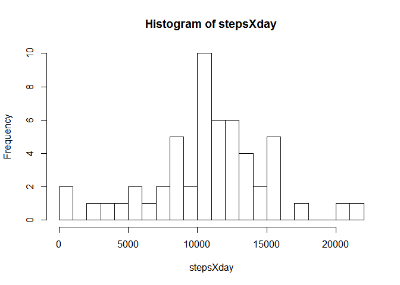
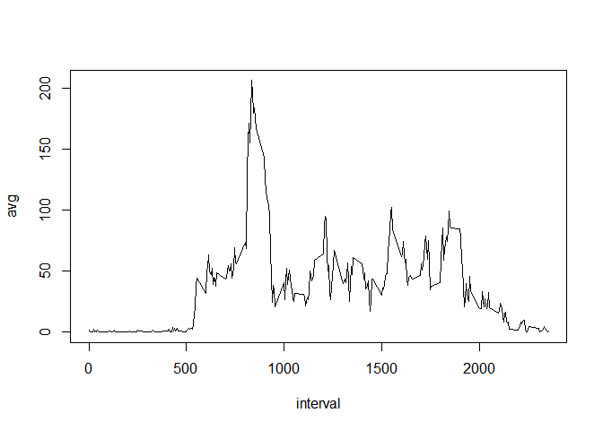
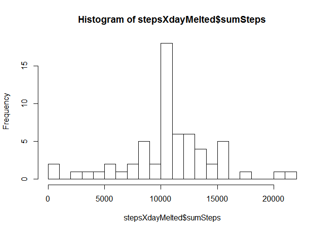
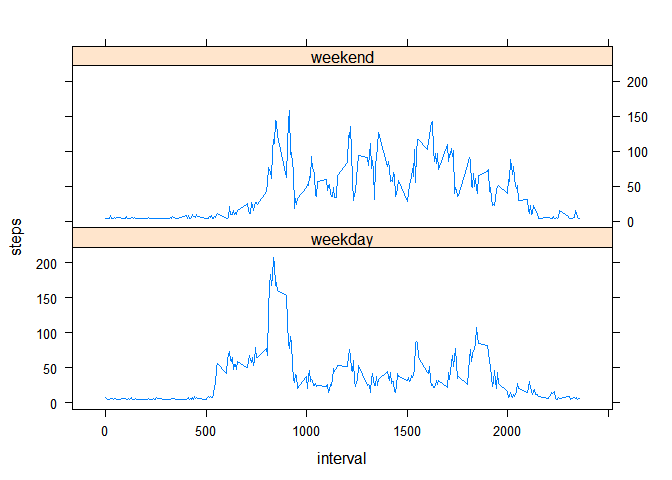

# PA1_template
Natxo Reguera  
12 de octubre de 2015  

# Introduction

It is now possible to collect a large amount of data about personal movement using activity monitoring devices such as a Fitbit, Nike Fuelband, or Jawbone Up. These type of devices are part of the "quantified self" movement - a group of enthusiasts who take measurements about themselves regularly to improve their health, to find patterns in their behavior, or because they are tech geeks. But these data remain under-utilized both because the raw data are hard to obtain and there is a lack of statistical methods and software for processing and interpreting the data.

This assignment makes use of data from a personal activity monitoring device. This device collects data at 5 minute intervals through out the day. The data consists of two months of data from an anonymous individual collected during the months of October and November, 2012 and include the number of steps taken in 5 minute intervals each day.

# Data

The data for this assignment can be downloaded from the course web site:

Dataset: Activity monitoring data [52K]
The variables included in this dataset are:

steps: Number of steps taking in a 5-minute interval (missing values are coded as NA)

date: The date on which the measurement was taken in YYYY-MM-DD format

interval: Identifier for the 5-minute interval in which measurement was taken

The dataset is stored in a comma-separated-value (CSV) file and there are a total of 17,568 observations in this dataset.

# Preparation

First we set the working directory


Loading the libraries


```r
library(dplyr)
```

```
## 
## Attaching package: 'dplyr'
## 
## The following objects are masked from 'package:stats':
## 
##     filter, lag
## 
## The following objects are masked from 'package:base':
## 
##     intersect, setdiff, setequal, union
```

```r
library(reshape2)
library(lattice)
library(plyr)
```

```
## -------------------------------------------------------------------------
## You have loaded plyr after dplyr - this is likely to cause problems.
## If you need functions from both plyr and dplyr, please load plyr first, then dplyr:
## library(plyr); library(dplyr)
## -------------------------------------------------------------------------
## 
## Attaching package: 'plyr'
## 
## The following objects are masked from 'package:dplyr':
## 
##     arrange, count, desc, failwith, id, mutate, rename, summarise,
##     summarize
```

# 1. Reading and transforming the data for analysis. 
As the file was compressed in ZIP, for  this exercise it has been ommitted the use of download.file function, that would keep more trazability over the process. 

The date field it has been transformed and it has been created a dataset without the NAs


```r
act <- read.csv("activity.csv")
act$date <- as.Date(act$date, format = "%Y-%m-%d")
nona <- act[complete.cases(act$steps),]
```

# 2. What is mean total number of steps taken per day? 
Histogram of it and mean / median


```r
stepsXday <- tapply(nona$steps, nona$date, sum)
hist(stepsXday, breaks = 20)
```

 

```r
mean(stepsXday)
```

```
## [1] 10766.19
```

```r
median(stepsXday)
```

```
## [1] 10765
```

# 3. What is the average daily activity pattern? 

Plot the pattern


```r
stepsXinterval <- tapply(nona$steps, nona$interval, mean)
stepsXintervalMelt <- melt(stepsXinterval)
names(stepsXintervalMelt) <- c("interval", "avg")
plot(stepsXintervalMelt, type = "l")
```

 

Calculate the 5 minute interval with the maximum number of steps


```r
stepsXintervalMelt[stepsXintervalMelt$avg == max(stepsXintervalMelt$avg),]
```

```
##     interval      avg
## 104      835 206.1698
```

# 4. Imputing missing values
Number of missing values (steps)


```r
nrow(act[complete.cases(act$steps) == FALSE,])
```

```
## [1] 2304
```

```r
actData <- act
actData$steps[is.na(actData$steps)] <- mean(actData$steps, na.rm = TRUE)
```

Histogram of the total number of steps per day


```r
stepsXday <- tapply(actData$steps, actData$date, sum)
stepsXdayMelted <- melt(stepsXday)
names(stepsXdayMelted) = c("date","sumSteps")
hist(stepsXdayMelted$sumSteps, breaks = 20)
```

 

Calculate the mean and median


```r
mean(stepsXdayMelted$sumSteps)
```

```
## [1] 10766.19
```

```r
median(stepsXdayMelted$sumSteps)
```

```
## [1] 10766.19
```
# 5. Are there differences in activity patterns between weekdays and weekends?


```r
actData$weekday <- weekdays(actData$date)
actData$dayType[(actData$weekday == "sábado" | actData$weekday == "domingo")] <- "weekend"
actData$dayType[!(actData$weekday == "sábado" | actData$weekday == "domingo")] <- "weekday"
stepWeek <- ddply(actData, c("interval", "dayType"), function(x) apply (x[1], 2, mean))
xyplot(steps ~ interval | dayType, data = stepWeek, type ="l", layout = c(1,2))
```

 
